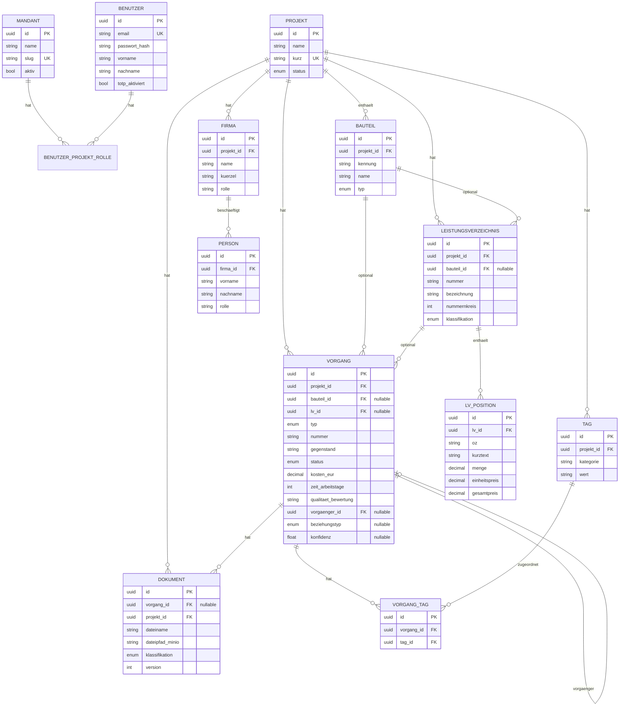

# BP-V-01 — Datenmodell-Schema

**Version:** 1.0
**Stand:** 04. Mai 2026
**Grundlage:** Entscheidungen B-001, B-002, B-003

---

## 1. Architektur-Entscheidungen

Das Datenmodell setzt drei Architekturentscheidungen um:

**B-001 Bauteil-Ebene:** Eigene Tabelle `bauteile` zwischen Projekt und Vorgang/LV. Referenz optional (NULL erlaubt). Zusaetzliches Tag-System fuer flexible Dimensionen.

**B-002 Verknuepfungsanalyse:** Deterministische Kaskade ueber `vorgaenger_id` an der Tabelle `vorgaenge`. Konfidenzfeld fuer LLM-Vorschlaege (Schicht 2).

**B-003 Schema-per-Tenant:** Tabellen `mandanten`, `benutzer` und `benutzer_projekt_rollen` im shared-Schema. Alle projektbezogenen Tabellen im Mandanten-Schema (z.B. `tenant_tlbv`).

---

## 2. Entity-Relationship-Diagramm

---

## 3. Schema-Aufteilung

**shared-Schema:**
- `mandanten` — Mandantenverzeichnis
- `benutzer` — Benutzerkonten
- `benutzer_projekt_rollen` — Zuordnung Benutzer → Mandant/Projekt → Rolle

**tenant_{slug}-Schema (pro Mandant):**
- `projekte`
- `bauteile`
- `leistungsverzeichnisse`
- `lv_positionen`
- `vorgaenge`
- `dokumente`
- `firmen`
- `personen`
- `tags`
- `vorgang_tags`

---

## 4. Audit-Felder (an jeder Tabelle)

Jede Tabelle traegt die folgenden Felder (G2 Revisionssicherheit):

- `id` (UUID, PK, server-generiert)
- `erstellt_am` (timestamp with timezone)
- `erstellt_von` (string)
- `geaendert_am` (timestamp with timezone, nullable)
- `geaendert_von` (string, nullable)
- `geloescht` (bool, default false)
- `geloescht_am` (timestamp with timezone, nullable)
- `geloescht_von` (string, nullable)

Physisches Loeschen ist nicht vorgesehen. Soft-Delete ueber das `geloescht`-Flag.

---

## 5. FLI-Stammdaten (Erstbefuellung)

Nach Schema-Migration werden folgende Stammdaten fuer das FLI-Projekt angelegt:

**Mandant:** TLBV (slug: `tlbv`)

**Projekt:** FLI Jena (kurz: `fli`, status: `bau`)

**Bauteile:** Geb. 30, Geb. 31, Geb. 32, Geb. 33, Geb. 34, Aussenanlagen

**Firmen:** TLBV (Bauherr), BWP Architekten (GP), AGE (GU), IBB (Fachbuero), VA Heinekamp (Fachbuero), Gerwert und Partner (Fachbuero), FLI (Nutzer)

**Tags (Beispiele):**
- Kategorie `bauphase`: Rohbau, Fassade, HLS, Elektro, Innenausbau, Aussenanlagen
- Kategorie `gewerk`: AA, ARC, TGA, LAB, LAP, TWP, VAI

---

**Dokumentstatus:** v1.0 — Erstfassung auf Basis der Entscheidungen B-001 bis B-003.
